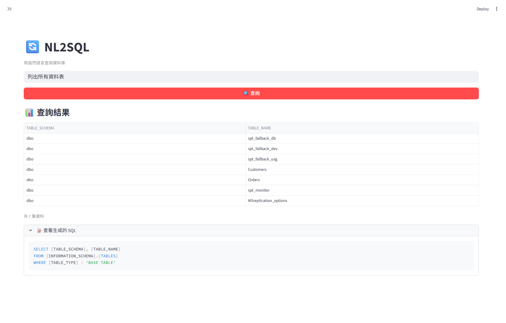
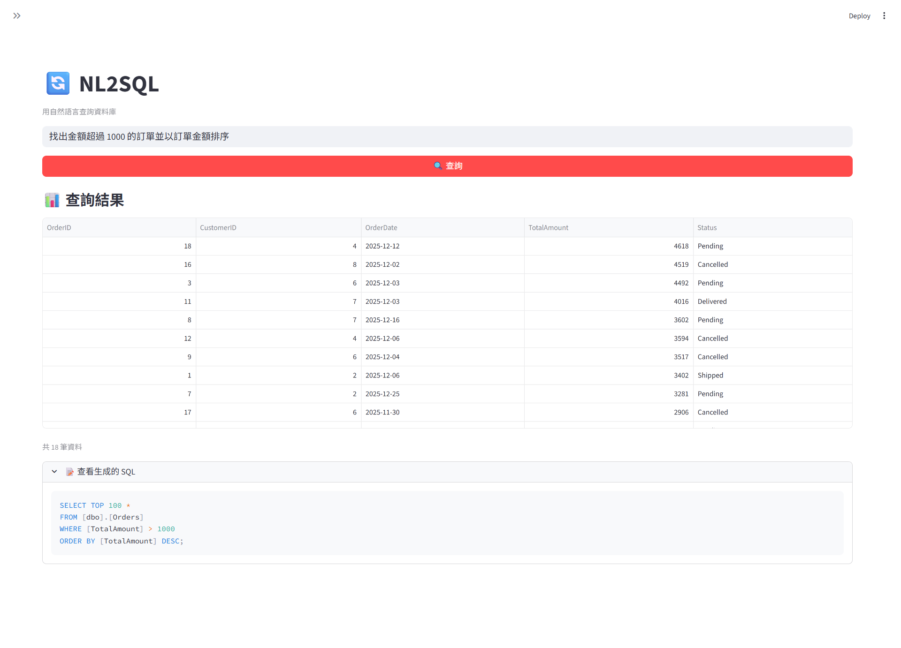

# NL2SQL - 自然語言轉 T-SQL 工具

將自然語言轉換為 T-SQL 查詢的 Web 應用程式，整合 Microsoft Agent Framework 與 Azure OpenAI。



## ✨ 功能特色

- 🤖 **Agentic Mode**：使用 Microsoft Agent Framework，自動取得 Schema、生成 SQL、測試執行
- 🔄 **一鍵查詢**：輸入問題 → 直接顯示結果表格
- 📋 **自動 Schema 載入**：首次查詢時自動從資料庫提取 Schema
- 🛠️ **自我修正**：遇到 SQL 錯誤時自動分析並修正

## 📸 使用範例



## 🛠️ 技術棧

| 類別 | 技術 |
|------|------|
| Web UI | Streamlit |
| AI Agent | Microsoft Agent Framework (Preview) |
| LLM | Azure OpenAI (GPT-4o) |
| 資料庫 | SQL Server (T-SQL) |
| 套件管理 | uv |

## 🚀 快速開始

### 1. 安裝依賴

```bash
# 使用 uv 建立虛擬環境並安裝依賴
uv sync
```

### 2. 設定環境變數

複製 `.env.template` 為 `.env` 並填入您的設定：

```bash
cp .env.template .env
```

編輯 `.env` 檔案：

```env
# Azure OpenAI 設定
AZURE_OPENAI_ENDPOINT=https://your-resource.openai.azure.com
AZURE_OPENAI_API_KEY=your-api-key
AZURE_OPENAI_DEPLOYMENT_NAME=gpt-4o
AZURE_OPENAI_API_VERSION=2025-01-01-preview

# SQL Server 連線字串
SQL_SERVER_CONNECTION_STRING=Driver={ODBC Driver 18 for SQL Server};Server=localhost,1433;Database=master;UID=sa;PWD=YourPassword;TrustServerCertificate=yes;
```

### 3. 啟動資料庫 (Docker)

```bash
docker compose up -d
```

### 4. 啟動應用程式

```bash
uv run streamlit run app.py
```

瀏覽器會自動開啟 http://localhost:8501

## 📖 使用說明

1. **輸入問題**：在輸入框輸入自然語言查詢
2. **點擊查詢**：按「🔍 查詢」按鈕
3. **查看結果**：直接顯示結果表格，SQL 詳情可展開查看

### 查詢範例

- `列出所有資料表`
- `顯示所有客戶的姓名和 Email`
- `顯示每個客戶的訂單總金額`
- `找出金額超過 1000 的訂單`

## 📁 專案結構

```
NL2SQL/
├── app.py                 # Streamlit 主程式
├── sql_agent.py           # NL2SQL Agent (Agent Framework + 備援)
├── agent_tools.py         # Agent 自定義工具 (Schema/SQL執行)
├── db_connector.py        # SQL Server 連線工具
├── schema_extractor.py    # Schema 提取工具
├── config.py              # 設定管理
├── pyproject.toml         # 專案設定 (uv)
├── docker-compose.yml     # SQL Server 容器設定
├── .env.template          # 環境變數範本
└── README.md
```

## ⚠️ 注意事項

> [!IMPORTANT]
> **必要安裝步驟：**
> 1. 安裝 **ODBC Driver 18 for SQL Server**
>    - [👉 點此下載 (Windows)](https://go.microsoft.com/fwlink/?linkid=2280795)
> 
> 2. 確保 Azure OpenAI 資源已建立並部署模型
> 3. 確保 SQL Server 已啟動：`docker compose up -d`

## 📄 License

MIT
